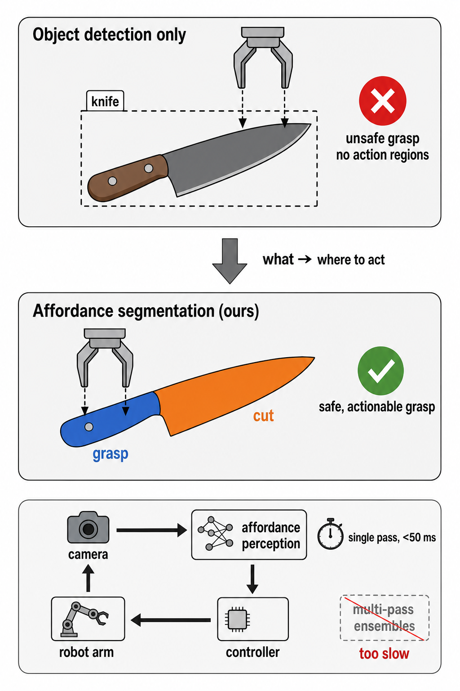
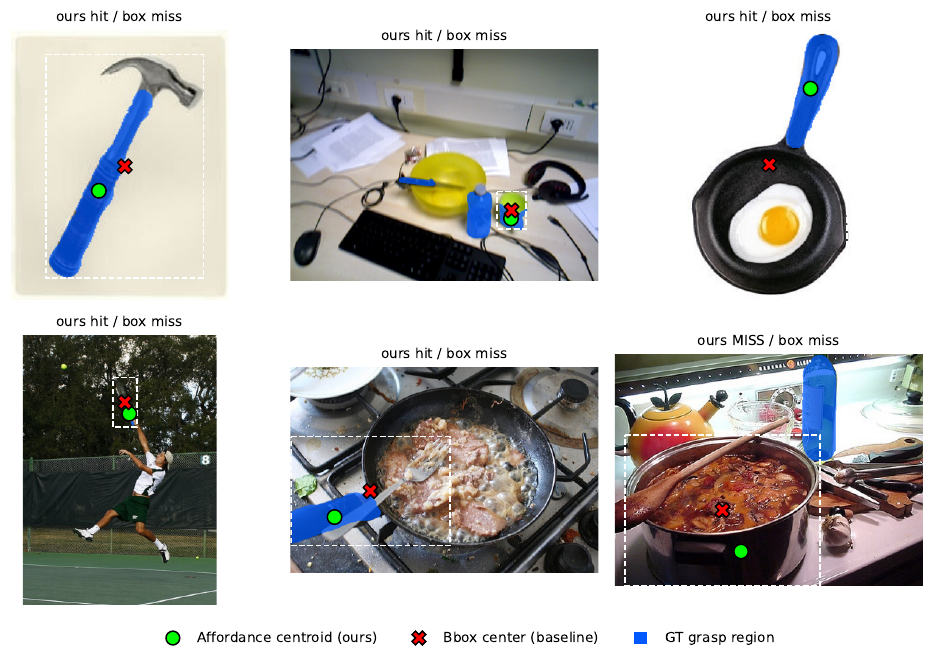
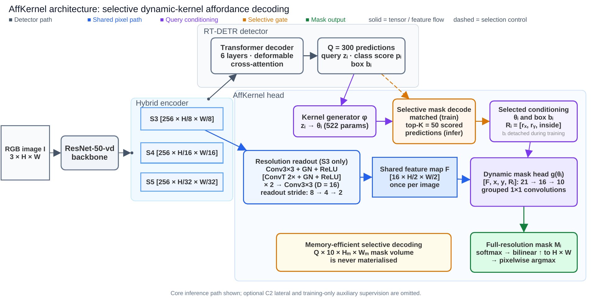

<div align="center">

# AffKernel

**Single-pass, NMS-free affordance segmentation for real-time robotic manipulation**

[](https://github.com/anh0001/affkernel/actions/workflows/ci.yml)
[](LICENSE)
[](https://www.python.org/downloads/release/python-380/)
[](https://pytorch.org/)
[](https://huggingface.co/anhrisn/affkernel-iit-aff)

</div>

A detector tells a robot *what* an object is. It does not tell the robot *where*
to act on it. AffKernel predicts object boxes and per-object, per-pixel
affordance masks in **one forward pass**, so a manipulator can pick a knife up
by its handle instead of its blade, within a latency budget a control loop can
actually afford.

<div align="center">

</div>

## Highlights

- **Single-pass and NMS-free.** RT-DETR object queries drive a CondInst-style
  per-query dynamic-convolution kernel that decodes masks from one shared
  high-resolution affordance map. Only matched (training) or top-*K* (inference)
  queries are decoded, so there is no region-proposal stage and no per-instance
  RoI recompute.
- **Deterministic and real time.** 16.3 ms median latency, 62 FPS on a single
  RTX 6000 Ada at 640x640, fp32 — 12.8 ms and 78 FPS with fp16, CUDA graphs and
  folded BatchNorm. No ensembling, no stochastic passes.
- **Runs on the robot, not just the development machine.** 23.1 FPS end to end
  on a Jetson AGX Orin within 0.23 GiB of peak allocated GPU memory, for 0.0007
  `F_beta^w` — see [Deployment on NVIDIA Jetson](#deployment-on-nvidia-jetson).
- **Resolution is the lever.** Raising the affordance readout from stride-8 to
  stride-2 moves accuracy more consistently than any change to mask-head
  complexity examined here, for +1.1 ms and +21 MiB at the final step.
- **Two benchmarks, one recipe.** Retrained from scratch on UMD
  Part-Affordance, the same configuration holds up without dataset-specific
  tuning. This is a second-dataset check, not transfer or fine-tuning: no
  IIT-AFF weights are carried over.

## Results

### IIT-AFF

Weighted F-measure `F_beta^w` (Margolin et al.), mean over three training seeds
(42, 7, 123), last-epoch EMA weights.

> **Read these results as exploratory, not confirmatory.** IIT-AFF ships no
> validation split, so the same test set that produces the headline also
> informed the recipe as it evolved, the component comparisons, and the choice
> of the reported configuration. Fixing the last-epoch checkpoint a priori
> prevents peak-checkpoint selection, but it does not control that broader
> adaptive use. Treat the resolution finding as evidence from a single
> benchmark rather than an estimate of generalisation.

| Model | `F_beta^w` (beta^2=1) | `F_beta^w` (beta^2=0.3) | Latency | Deterministic |
|---|---:|---:|---:|:--:|
| **AffKernel (R50vd, stride-2 + deep sup.)** | **0.8675 ± 0.0009** | 0.8574 ± 0.0008 | **16.3 ms** | yes |
| Mask R-CNN (reported) | 0.844 | -- | 45 ms | yes |
| Deterministic Swin-T (reported) | 0.883 | -- | 42 ms | yes |
| Bayesian Swin-T deep ensemble (reported) | 0.906 | -- | ~1015 ms | no |

AffKernel improves on the Mask R-CNN baseline by 0.0235 and trails the
deterministic Swin-T by 0.0155 and the Bayesian ensemble by 0.0385. Latencies
are batch-1 timings **on each method's originally reported hardware and are not
normalised** (peers on RTX 4090, ours on RTX 6000 Ada), so they indicate
distinct operating regimes rather than a hardware-normalised speedup; no ratio
between them is meaningful. Peer numbers are quoted from their publications; see
[`docs/reproduction.md`](docs/reproduction.md) for the protocol caveats that
apply when comparing across papers, in particular the beta convention.

On instances that *are* detected, mask quality reaches 0.893. This row excludes
detection misses, so it is **not protocol-matched** to the peers' full-set
figures and is not a state-of-the-art claim; it is a within-model diagnostic
indicating that the residual gap is dominated by detection recall rather than by
mask quality.

### Readout-resolution ladder

The detector is untouched across these rows; only the affordance readout changes.

| Affordance readout | `F_beta^w` (beta^2=1) |
|---|---:|
| stride-8 | 0.7518 |
| stride-4 | 0.8269 |
| stride-2 | 0.8542 ± 0.0016 |
| stride-2 + deep supervision | **0.8675 ± 0.0009** |

### UMD Part-Affordance

Mean over the same three seeds, retrained from scratch. A single seed will not
reproduce these means.

| Split | `F_beta^w` (beta^2=1) |
|---|---:|
| Full test split | 0.8752 ± 0.0049 |
| Human-annotated subset | 0.8799 ± 0.0048 |

Protocol caveat: peer UMD numbers in the literature are compiled from a source
whose split, ground-truth handling and beta convention are not stated, so our
rows use a reconstructed AffordanceNet-lineage protocol. The human-annotated
subset (every third frame) is itself a documented approximation. Cross-paper
UMD comparisons should be read with that in mind.

> **Not in this repository yet.** The paper additionally reports a
> post-processing tier ("sub-threshold mask recovery") that recovers masks from
> sub-gate queries and fills empty per-image, per-class slots, worth about
> +0.0073 on IIT-AFF and producing the paper's best UMD row. It is not
> implemented here, so the figures above are the pre-recovery ones and the
> paper's best reported numbers cannot be reproduced from this code as it
> stands.

### Actionability

Predicted affordance regions are better grasp targets than detection-box
centres. The supporting numbers are being re-measured: the evaluation loop
behind them counts only images in which a detection succeeded, which mislabels
the denominator and overstates the absolute hit rate. The comparison itself
(a large margin over the box centre) holds under either denominator. Figures
will be restored here once the corrected measurement is finalised.

### RTX 6000 Ada

**Model only** — forward pass plus postprocessing. This is the protocol behind
the latency column above and throughout the paper. Batch 1, 640x640, fp32 unless
noted; *optimized* means fp16 with CUDA graphs and folded BatchNorm.

| Configuration | Median | FPS | Peak GPU |
|---|---:|---:|---:|
| Previous code path, stride-2 | 24.1 ms | 41.4 | 1319 MiB |
| stride-4 | 15.2 ms | 65.9 | 421 MiB |
| **stride-2 (headline)** | **16.3 ms** | **61.5** | **442 MiB** |
| stride-4, optimized | 11.4 ms | 87.6 | 272 MiB |
| **stride-2, optimized** | **12.8 ms** | **78.4** | **284 MiB** |

Raising the readout from stride-4 to stride-2 costs +1.1 ms (+7%) and +21 MiB.
That is a small price for the accuracy step, not a free one.

Decoding more queries is also close to free, because the expensive affordance
map is computed once and shared (stride-2, fp32):

| Top-*K* | 50 | 100 | 150 | 300 |
|---|---:|---:|---:|---:|
| Median | 16.3 ms | 16.3 ms | 16.4 ms | 16.5 ms |
| Peak GPU | 443 MiB | 492 MiB | 542 MiB | 692 MiB |

**End to end** — preprocessing, forward pass, mask decoding and the
device-to-host copy, via `AffordanceModel.infer()`:

| Inference path | End to end | FPS | Peak GPU | `F_beta^w` (0.3 / 1) |
|---|---:|---:|---:|---:|
| fp32, as released | 35.7 ms | 28.0 | 0.43 GiB | 0.8582 / 0.8685 |
| **fp16 + CUDA graph + BN fold** | **16.0 ms** | **62.7** | **0.29 GiB** | **0.8577 / 0.8680** |

The fastest path costs **0.0005** `F_beta^w` at beta^2=1 — below the +-0.0009
seed-to-seed spread of the training run itself.

> **On the memory column.** Peak GPU is `torch.cuda.max_memory_allocated()` with
> a *single* resident input tensor. Earlier revisions of this table were measured
> while the benchmark held all 210 decoded evaluation images on the device
> (~984 MiB in fp32), so those figures counted the harness's input buffers as
> well as the model. Relative comparisons were unaffected — the contamination was
> a constant offset — but the absolute values were inflated by about 1 GiB.
> `tools/bench_latency_size.py` still pre-loads its images, so read its memory
> output with that in mind.

### Jetson AGX Orin

The released fp32 checkpoint, unmodified, on a Jetson AGX Orin Developer Kit
(64 GB, JetPack 6.2, MAXN) at 640x640, batch 1. Latency is end-to-end
`AffordanceModel.infer()` — preprocessing, forward pass, mask decoding and the
device-to-host copy — measured on the same image, so these rows are directly
comparable to the RTX 6000 Ada end-to-end table above, and not to the model-only
figures.

| Inference path | Forward | End to end | FPS | Peak GPU | `F_beta^w` (0.3 / 1) |
|---|---:|---:|---:|---:|---:|
| fp32, as released | -- | 199.5 ms | 5.0 | 1.29 GiB | 0.8598 / 0.8680 |
| `--half --cudagraph` | 34.0 ms | 53.2 ms | 18.8 | 0.21 GiB | 0.8596 / 0.8678 |
| **`--trt-backbone`** | **22.6 ms** | **43.4 ms** | **23.1** | **0.23 GiB** | **0.8591 / 0.8673** |

`F_beta^w` is over the full 2,651-image IIT-AFF test split. The fp32 row is a
same-machine reference, not a separate claim: it reproduces the published
0.8582 / 0.8685 for this checkpoint to within 0.0016, which is what licenses
reading the other rows as deltas. **The fastest path costs 0.0007** — below the
+-0.0009 seed-to-seed spread of the training run itself.

Lowering the input to 512x512 is *not* worth it: it costs 0.007 `F_beta^w`, ten
times more than fp16 plus TensorRT, to save less time.

### Qualitative

<div align="center">

</div>

## Method

<div align="center">

</div>

A ResNet-50vd backbone feeds an RT-DETR hybrid encoder and transformer decoder.
In parallel, an affordance branch fuses one lateral carrying detail from the
backbone's second-stage feature map into a shared affordance feature map and
upsamples it to stride-2. Each object query emits a small dynamic convolution
kernel; that kernel is convolved with the shared map to produce that instance's
affordance masks. Box-normalised coordinate channels condition the decoding on
the query's box, but this is soft conditioning over the full feature map, not
RoI processing: the coordinates are defined outside the box as well, and no
cropping or resampling takes place. Because the expensive feature map is
computed once and shared, adding instances costs almost nothing, and raising the
readout resolution adds only a small fixed cost (+1.1 ms at the final step).

## Installation

Requires Python 3.8 and a CUDA-capable GPU for training. The pinned stack is
PyTorch 2.0.1 + cu117.

```bash
git clone https://github.com/anh0001/affkernel.git
cd affkernel

conda create -n affkernel python=3.8 -y
conda activate affkernel
pip install -r requirements.txt
```

For development (linting, tests):

```bash
pip install -r requirements-dev.txt
```

Verify the install without any dataset present:

```bash
python -m unittest discover -s tests -v
```

Dataset-dependent tests skip automatically when the data is not on disk.

## Quick start

Download the released checkpoint and run inference on your own image:

```bash
pip install huggingface_hub
hf download anhrisn/affkernel-iit-aff affkernel_iit_r50vd_stride2_deepsup_seed42.pth --local-dir weights/

python tools/infer.py \
  -c configs/rtdetr/rtdetr_r50vd_6x_iit_v3_stride2_deepsup.yml \
  -r weights/affkernel_iit_r50vd_stride2_deepsup_seed42.pth \
  --input path/to/image.jpg \
  --output outputs/
```

`--input` takes either a single image or a directory of images. `--output` is a
**directory**; each result is written as `<stem>_aff.png`. Add `--device cpu` to
run without a GPU, and `--score-thr` to change the detection threshold
(default 0.6).

For the example image above this prints:

```
image.jpg: 3 detection(s) -> outputs/image_aff.png
    label=2  score=0.979 affordances=[display]          grasp_point=None
    label=10 score=0.953 affordances=[contain, grasp]   grasp_point=(321, 297)
    label=6  score=0.946 affordances=[contain, w-grasp] grasp_point=(447, 321)
```

The first run downloads ImageNet-pretrained backbone weights from the RT-DETR
release artefacts, so it needs network access.

## Deployment on NVIDIA Jetson

Verified on a **Jetson AGX Orin Developer Kit (64 GB)** running JetPack 6.2
(L4T R36.4.7, CUDA 12.6, TensorRT 10.3) with Python 3.10, torch 2.8.0 and
torchvision 0.23.0. Nothing here is Orin-specific — the same flags apply to Orin
NX/Nano, with proportionally lower throughput.

### 1. Environment

The pinned x86 stack in `requirements.txt` (Python 3.8, torch 2.0.1+cu117) does
**not** apply on Jetson: use NVIDIA's own aarch64 wheels, which are built
against the JetPack CUDA. Install everything *except* torch/torchvision from
the requirements file.

```bash
sudo nvpmodel -m 0            # MAXN; the numbers above assume it

python3 -m venv ~/.venvs/affkernel
source ~/.venvs/affkernel/bin/activate
# torch + torchvision from NVIDIA's Jetson index (see JetPack release notes for
# the wheel matching your L4T version), then the rest:
pip install "numpy<2" PyYAML "scipy<1.11" packaging "Pillow<11" matplotlib pycocotools onnx
```

TensorRT ships with JetPack as a system package rather than a wheel, so a
virtualenv cannot see it by default. Either create the venv with
`--system-site-packages`, or point at it per command:

```bash
export PYTHONPATH=/usr/lib/python3.10/dist-packages   # adjust for your Python
python -c "import tensorrt; print(tensorrt.__version__)"
```

### 2. Run

Two GPU-side flags need no extra setup and are safe on any CUDA device:

```bash
python tools/infer.py \
  -c configs/rtdetr/rtdetr_r50vd_6x_iit_v3_stride2_deepsup.yml \
  -r weights/affkernel_iit_r50vd_stride2_deepsup_seed42.pth \
  --input path/to/image.jpg --output outputs/ \
  --half --cudagraph --gpu-preprocess
```

- `--half` runs the model in fp16.
- `--cudagraph` captures the fixed-shape forward pass in a CUDA graph. On
  embedded GPUs the decoder is launch-bound, and replaying a captured graph is
  *bit-exact* against the eager forward at the same dtype.
- `--gpu-preprocess` does the resize and normalisation on the device.

### 3. Optional: TensorRT backbone

The dynamic-kernel affordance head cannot be exported to ONNX, but the backbone
is plain convolutions and exports cleanly — and it is the single largest term of
the forward pass. Building it as an fp16 engine, while the encoder, decoder and
affordance head stay in PyTorch, takes the backbone from 17.7 ms to 5.3 ms:

```bash
python tools/build_trt_backbone.py \
  -c configs/rtdetr/rtdetr_r50vd_6x_iit_v3_stride2_deepsup.yml \
  -r weights/affkernel_iit_r50vd_stride2_deepsup_seed42.pth \
  --out weights/backbone_fp16.plan          # a few minutes

python tools/infer.py \
  -c configs/rtdetr/rtdetr_r50vd_6x_iit_v3_stride2_deepsup.yml \
  -r weights/affkernel_iit_r50vd_stride2_deepsup_seed42.pth \
  --input path/to/image.jpg --output outputs/ \
  --trt-backbone weights/backbone_fp16.plan --gpu-preprocess
```

`--trt-backbone` implies fp16, and the PyTorch tail is still CUDA-graphed
against the engine's output buffers, so a frame costs one engine enqueue plus
one graph replay.

> **Engine files are not portable.** A `.plan` is specific to the GPU, the
> TensorRT version and the input size it was built for. Rebuild it on the target
> device; do not copy one between machines. Keep the checkpoint — the engine
> replaces the backbone at inference only, and training is unaffected.

A prebuilt engine for one specific configuration — AGX Orin, JetPack 6.2, TensorRT
10.3, 640x640 — ships alongside the checkpoint on the Hub, as a convenience for
identical setups:

```bash
hf download anhrisn/affkernel-iit-aff backbone_fp16.plan --local-dir weights/
```

If your device, JetPack/TensorRT version or input size differs in any respect,
build your own with the command above instead. That is the supported path.

### As a library

```python
from tools.infer import AffordanceModel

model = AffordanceModel(config_path, checkpoint_path,
                        half=True, cudagraph=True, gpu_preprocess=True)
                        # or: trt_backbone="weights/backbone_fp16.plan"

for det in model.infer(rgb, score_thresh=0.6):
    det.label, det.score, det.box_xyxy, det.mask   # mask: [H, W] class ids
```

## Datasets

Neither dataset is redistributed here. Both are obtained from their original
authors, whose citation requests you should honour.

- **IIT-AFF** (Nguyen et al., IROS 2017): 8,835 images, 10 object classes,
  9 affordance classes.
- **UMD Part-Affordance** (Myers et al., ICRA 2015): 28,843 labelled frames,
  17 tool categories, 7 affordance classes.

Full acquisition and directory-layout instructions are in
[`docs/datasets.md`](docs/datasets.md).

## Training

Reproduce the released model (about 15.5 hours on one RTX 6000 Ada):

```bash
CUDA_VISIBLE_DEVICES=0 python tools/train.py \
  -c configs/rtdetr/rtdetr_r50vd_6x_iit_v3_stride2_deepsup.yml \
  --seed 42
```

> **`--seed` has no default.** Omitting it leaves the run unseeded and
> unreproducible. The released weights use `--seed 42`.

Multi-GPU:

```bash
CUDA_VISIBLE_DEVICES=0,1,2,3 torchrun --nproc_per_node=4 --master_port=8989 \
  tools/train.py -c configs/rtdetr/rtdetr_r50vd_6x_iit_v3_stride2_deepsup.yml --seed 42
```

## Evaluation

```bash
# beta^2=0.3, the AffordanceNet-lineage convention (reported alongside, not the
# headline; every cross-paper table in the paper uses beta^2=1)
python tools/train.py -c <config> -r <checkpoint> --test-only

# beta^2=1, matching the convention recent transformer baselines report
python tools/decompose_fbw_gap.py -c <config> -r <checkpoint> --beta2 1.0

# both conventions from a single forward pass
python tools/rescore_fbw_beta.py -c <config> -r <checkpoint> --betas 0.3 1.0

# latency and throughput
python tools/bench_latency_size.py -c <config> -r <checkpoint> --sizes 640
```

Every command needed to regenerate each published number, including the
resolution ladder, is listed in [`docs/reproduction.md`](docs/reproduction.md).

## Model zoo

| Model | Dataset | `F_beta^w` (beta^2=1) | Download |
|---|---|---:|---|
| AffKernel R50vd, stride-2 + deep sup., seed 42 | IIT-AFF | 0.8685 | [Hugging Face](https://huggingface.co/anhrisn/affkernel-iit-aff) |
| &nbsp;&nbsp;+ TensorRT fp16 backbone engine, Jetson AGX Orin | IIT-AFF | 0.8673 | [`backbone_fp16.plan`](https://huggingface.co/anhrisn/affkernel-iit-aff/blob/main/backbone_fp16.plan) |

The second row is a **deployment artifact, not a separate model**: an fp16
TensorRT engine for the backbone alone, built for a Jetson AGX Orin on JetPack 6.2
with TensorRT 10.3 at 640x640. It ships in the same Hub repository, still needs
the checkpoint in the first row, and is not portable off that exact configuration
— see [Optional: TensorRT backbone](#3-optional-tensorrt-backbone). Its 0.8673 is
end-to-end on the IIT-AFF test split, 0.0007 below the fp32 checkpoint.

The released checkpoint is seed 42, which is both the primary anchor seed used
throughout the paper and the highest-scoring of the three seeds (seed 7: 0.8668,
seed 123: 0.8673). Weights are the last-epoch EMA parameters, stored fp32.

## Repository layout

```
configs/      YAML configuration files; the include chain is resolved by src/core
src/          library code
  core/       configuration and registry system
  data/       IIT-AFF, UMD and COCO datasets, transforms, evaluators
  nn/         backbones (ResNet-vd, Swin-T)
  zoo/rtdetr/ detector, affordance branch, criterion, matcher, postprocessor
  solver/     training and evaluation loops
tools/        command-line entry points (train, infer, evaluate, benchmark, export)
tests/        unittest suite
docs/         dataset acquisition and reproduction instructions
```

## Citation

If you use this code or the released weights, please cite the paper:

```bibtex
@article{risnumawan2026affkernel,
  title   = {AffKernel: High-Resolution Readout for Real-Time Visual
             Affordance Segmentation},
  author  = {Risnumawan, Anhar and Aji, Achmad Fahrul and
             Fatahillah, Teuku Zikri and Kubota, Naoyuki},
  journal = {Expert Systems with Applications},
  year    = {2026},
  note    = {Under review}
}
```

Please also cite the dataset you evaluate on; the BibTeX entries their authors
request are reproduced in [`docs/datasets.md`](docs/datasets.md).

## Acknowledgements

AffKernel builds directly on [RT-DETR](https://github.com/lyuwenyu/RT-DETR) by
lyuwenyu and, through it, on [DETR](https://github.com/facebookresearch/detr) by
Facebook Research. Both are Apache-2.0 licensed, and substantial portions of
`src/` are derived from them. The deformable-attention modules originate with
[Deformable-DETR](https://github.com/fundamentalvision/Deformable-DETR)
(SenseTime, Apache-2.0) and reach this codebase through RT-DETR. The
instance-conditioned dynamic-kernel decoding follows the *method* published as
CondInst (Tian et al., ECCV 2020); it is an independent implementation, and no
code from the AdelaiDet repository is used or redistributed here.

See [`NOTICE`](NOTICE) and [`THIRD_PARTY_LICENSES.md`](THIRD_PARTY_LICENSES.md)
for the per-file attribution inventory.

## License

AffKernel's own contributions are released under the [MIT License](LICENSE).
Portions derived from RT-DETR and DETR remain under the Apache License 2.0
(see [`licenses/Apache-2.0.txt`](licenses/Apache-2.0.txt)).
