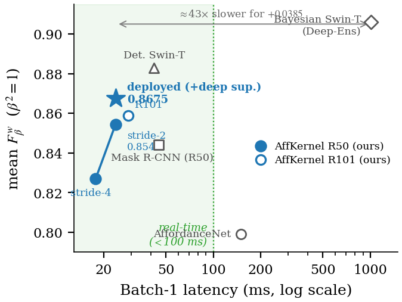

<div align="center">

# AffKernel

**Single-pass, NMS-free affordance segmentation for real-time robotic manipulation**

[](https://github.com/anh0001/affkernel/actions/workflows/ci.yml)
[](LICENSE)
[](https://www.python.org/downloads/release/python-380/)
[](https://pytorch.org/)
[](https://huggingface.co/anhrisn/affkernel-iit-aff)

</div>

A detector tells a robot *what* an object is. It does not tell the robot *where*
to act on it. AffKernel predicts object boxes and per-object, per-pixel
affordance masks in **one forward pass**, so a manipulator can pick a knife up
by its handle instead of its blade, within a latency budget a control loop can
actually afford.

<div align="center">

</div>

## Highlights

- **Single-pass and NMS-free.** RT-DETR object queries drive a CondInst-style
  per-query dynamic-convolution kernel that decodes masks from one shared
  high-resolution affordance map. Only matched (training) or top-*K* (inference)
  queries are decoded, so there is no region-proposal stage and no per-instance
  RoI recompute.
- **Deterministic and real time.** 23.8 ms median latency, 42 FPS on a single
  RTX 6000 Ada at 640x640, fp32. No ensembling, no stochastic passes.
- **Resolution is the lever.** Raising the affordance readout from stride-8 to
  stride-2 moves accuracy far more than any change to mask-head complexity, at
  no added inference cost.
- **Two benchmarks, one recipe.** The same configuration transfers to UMD
  Part-Affordance without dataset-specific tuning.

## Results

### IIT-AFF

Weighted F-measure `F_beta^w` (Margolin et al.), mean over three training seeds
(42, 7, 123), last-epoch EMA weights. IIT-AFF has no validation split, so
checkpoint selection is fixed a priori rather than tuned on the test set.

| Model | `F_beta^w` (beta^2=1) | `F_beta^w` (beta^2=0.3) | Latency | Deterministic |
|---|---:|---:|---:|:--:|
| **AffKernel (R50vd, stride-2 + deep sup.)** | **0.8675 ± 0.0009** | 0.8574 ± 0.0008 | **23.8 ms** | yes |
| Mask R-CNN (reported) | 0.844 | -- | 45 ms | yes |
| Deterministic Swin-T (reported) | 0.883 | -- | 42 ms | yes |
| Bayesian Swin-T deep ensemble (reported) | 0.906 | -- | ~1015 ms | no |

AffKernel improves on the Mask R-CNN baseline at roughly half its latency, and
runs at about 57% of the deterministic Swin-T's latency while trailing it by
1.55 points. Peer numbers are quoted from their publications; see
[`docs/reproduction.md`](docs/reproduction.md) for the protocol caveats that
apply when comparing across papers, in particular the beta convention.

Mask quality on instances that *are* detected already exceeds the Swin-T
baseline (0.893 vs 0.883). The residual gap is dominated by missed detections
rather than by mask quality.

### Readout-resolution ladder

The detector is untouched across these rows; only the affordance readout changes.

| Affordance readout | `F_beta^w` (beta^2=1) |
|---|---:|
| stride-8 | 0.7518 |
| stride-4 | 0.8269 |
| stride-2 | 0.8542 ± 0.0016 |
| stride-2 + deep supervision | **0.8675 ± 0.0009** |

### UMD Part-Affordance

| Split | `F_beta^w` (beta^2=1) |
|---|---:|
| Full test split | 0.8752 |
| Human-annotated subset | 0.8799 |

### Actionability

Predicted affordance regions are better grasp targets than detection-box centres:

| Cue | IIT-AFF (300 images) | Isaac Sim, pose-jittered |
|---|---:|---:|
| Affordance-selected point | **93.3%** | **67.5%** |
| Detection-box centre | 47.7% | 44.2% |

<div align="center">

</div>

### Qualitative

<div align="center">

</div>

## Method

<div align="center">

</div>

A ResNet-50vd backbone feeds an RT-DETR hybrid encoder and transformer decoder.
In parallel, an affordance branch fuses the C2 lateral into a shared affordance
feature map and upsamples it to stride-2. Each object query emits a small
dynamic convolution kernel; that kernel is convolved with the shared map,
restricted to the query's box, to produce that instance's affordance masks.
Because the expensive feature map is computed once and shared, adding instances
costs almost nothing, and raising the readout resolution costs nothing at
inference time.

## Installation

Requires Python 3.8 and a CUDA-capable GPU for training. The pinned stack is
PyTorch 2.0.1 + cu117.

```bash
git clone https://github.com/anh0001/affkernel.git
cd affkernel

conda create -n affkernel python=3.8 -y
conda activate affkernel
pip install -r requirements.txt
```

For development (linting, tests):

```bash
pip install -r requirements-dev.txt
```

Verify the install without any dataset present:

```bash
python -m unittest discover -s tests -v
```

Dataset-dependent tests skip automatically when the data is not on disk.

## Quick start

Download the released checkpoint and run inference on your own image:

```bash
pip install huggingface_hub
hf download anhrisn/affkernel-iit-aff affkernel_iit_r50vd_stride2_deepsup_seed42.pth --local-dir weights/

python tools/infer.py \
  -c configs/rtdetr/rtdetr_r50vd_6x_iit_v3_stride2_deepsup.yml \
  -r weights/affkernel_iit_r50vd_stride2_deepsup_seed42.pth \
  --input path/to/image.jpg \
  --output outputs/prediction.png
```

The first run downloads ImageNet-pretrained backbone weights from the RT-DETR
release artefacts, so it needs network access.

## Datasets

Neither dataset is redistributed here. Both are obtained from their original
authors, whose citation requests you should honour.

- **IIT-AFF** (Nguyen et al., IROS 2017): 8,835 images, 10 object classes,
  9 affordance classes.
- **UMD Part-Affordance** (Myers et al., ICRA 2015): 28,843 labelled frames,
  17 tool categories, 7 affordance classes.

Full acquisition and directory-layout instructions are in
[`docs/datasets.md`](docs/datasets.md).

## Training

Reproduce the released model (about 15.5 hours on one RTX 6000 Ada):

```bash
CUDA_VISIBLE_DEVICES=0 python tools/train.py \
  -c configs/rtdetr/rtdetr_r50vd_6x_iit_v3_stride2_deepsup.yml \
  --seed 42
```

> **`--seed` has no default.** Omitting it leaves the run unseeded and
> unreproducible. The released weights use `--seed 42`.

Multi-GPU:

```bash
CUDA_VISIBLE_DEVICES=0,1,2,3 torchrun --nproc_per_node=4 --master_port=8989 \
  tools/train.py -c configs/rtdetr/rtdetr_r50vd_6x_iit_v3_stride2_deepsup.yml --seed 42
```

## Evaluation

```bash
# headline metric (beta^2=0.3, the AffordanceNet convention)
python tools/train.py -c <config> -r <checkpoint> --test-only

# beta^2=1, matching the convention recent transformer baselines report
python tools/decompose_fbw_gap.py -c <config> -r <checkpoint> --beta2 1.0

# both conventions from a single forward pass
python tools/rescore_fbw_beta.py -c <config> -r <checkpoint> --betas 0.3 1.0

# latency and throughput
python tools/bench_latency_size.py -c <config> -r <checkpoint> --sizes 640
```

Every command needed to regenerate each published number, including the
resolution ladder, is listed in [`docs/reproduction.md`](docs/reproduction.md).

## Model zoo

| Model | Dataset | `F_beta^w` (beta^2=1) | Download |
|---|---|---:|---|
| AffKernel R50vd, stride-2 + deep sup., seed 42 | IIT-AFF | 0.8685 | [Hugging Face](https://huggingface.co/anhrisn/affkernel-iit-aff) |

The released checkpoint is seed 42, which is both the primary anchor seed used
throughout the paper and the highest-scoring of the three seeds (seed 7: 0.8668,
seed 123: 0.8673). Weights are the last-epoch EMA parameters, stored fp32.

## Repository layout

```
configs/      YAML configuration files; the include chain is resolved by src/core
src/          library code
  core/       configuration and registry system
  data/       IIT-AFF, UMD and COCO datasets, transforms, evaluators
  nn/         backbones (ResNet-vd, Swin-T)
  zoo/rtdetr/ detector, affordance branch, criterion, matcher, postprocessor
  solver/     training and evaluation loops
tools/        command-line entry points (train, infer, evaluate, benchmark, export)
tests/        unittest suite
docs/         dataset acquisition and reproduction instructions
```

## Citation

If you use this code or the released weights, please cite the paper:

```bibtex
@article{risnumawan2026affkernel,
  title   = {AffKernel: Single-Pass Affordance Segmentation with Per-Query
             Dynamic Convolution for Real-Time Robotic Manipulation},
  author  = {Risnumawan, Anhar},
  journal = {IEEE Access},
  year    = {2026},
  note    = {Under review}
}
```

Please also cite the dataset you evaluate on; the BibTeX entries their authors
request are reproduced in [`docs/datasets.md`](docs/datasets.md).

## Acknowledgements

AffKernel builds directly on [RT-DETR](https://github.com/lyuwenyu/RT-DETR) by
lyuwenyu and, through it, on [DETR](https://github.com/facebookresearch/detr) by
Facebook Research. Both are Apache-2.0 licensed, and substantial portions of
`src/` are derived from them. The instance-conditioned dynamic-kernel decoding
follows [CondInst](https://github.com/aim-uofa/AdelaiDet).

See [`NOTICE`](NOTICE) and [`THIRD_PARTY_LICENSES.md`](THIRD_PARTY_LICENSES.md)
for the per-file attribution inventory.

## License

AffKernel's own contributions are released under the [MIT License](LICENSE).
Portions derived from RT-DETR and DETR remain under the Apache License 2.0
(see [`licenses/Apache-2.0.txt`](licenses/Apache-2.0.txt)).
